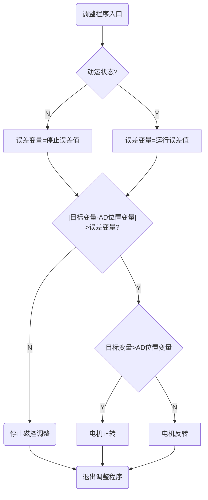

### 变量定义：目标变量、AD位置变量、运动状态（运行、停止）、误差变量,
### 常量定义：运行误差值，停止误差值，其中运动误差<停止误差，例如运动误差值为4，停止误差值为8，可根据实际情况微调。

```mermaid
graph TB
    A(调整程序入口) -->B{动运状态?}


    B--N-->C[误差变量=停止误差值]
    B--Y-->F[误差变量=运行误差值]
    C-->D{"|目标变量-AD位置变量|<br>>误差变量?"}
    F-->D{"|目标变量-AD位置变量|<br>>误差变量?"}
    D--Y-->G{目标变量>AD位置变量}
    D--N-->H(停止磁控调整)
    G--Y-->I[电机正转]
    G--N-->J[电机反转]
    H-->K(退出调整程序)
    I-->K
    J-->K

```

#### 何凤龙/20230904

